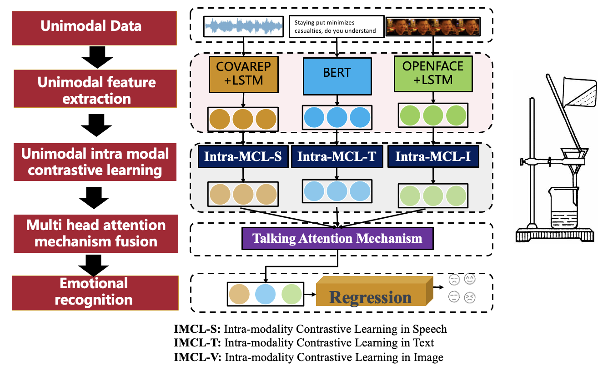

# Filtering Negative Information for Multimodal Emotion Recognition

This is the open source code for paper: Filtering Negative Information for Multimodal Emotion Recognition

## Intro
>Multimodal emotion recognition is at the vanguard of enhancing human-computer interaction, offering the potential to substantially narrow the communication divide between humans and machines by precisely identifying human emotions. Utilizing a wide range of inputs,including facial expressions, speech, text, and physiological signals, this technology seeks to cultivate a profound and detailed understanding of emotional states. Nonetheless, prevailing approaches tend to focus on synchronizing these multimodal data to heighten accuracy, often overlooking the pivotal role of negative information, which could result in erroneous interpretations of emotional expressions. Motivated by the analogy of impurity removal in chemistry, this study introduces a novel methodology that leverages contrastive learning and a multi-head attention mechanism to adeptly eliminate negative information from speech, text, and image data, thereby enhancing the precision of emotion recognition. This innovative amalgamation achieves notable improvements in amalgamating diverse emotional signals, proficiently capturing and analyzing emotional features across different modalities. The related code has been made open-source.



## Usage

1. As mentioned in our paper, you need to download the CMU-MOSI and CMU-MOSEI dataset. Then place them under the folder `MECAM/datasets`

2. Environment 
```
python 3.8
torch 1.7.1
torchvision 0.8.2
tensorboardX 1.9
tensorflow-estimator 2.3.0
tensorflow-gpu 2.3.1
transformers 4.0.0
```

3. Start training
```
python main.py
```

## Contact 
```
If you have any question about our work, please feel free to contact us:

- Yaoyang Wang : wangyaoyang@shu.edu.cn
- Xianxu Zhu :  1591694407@qq.com
```

